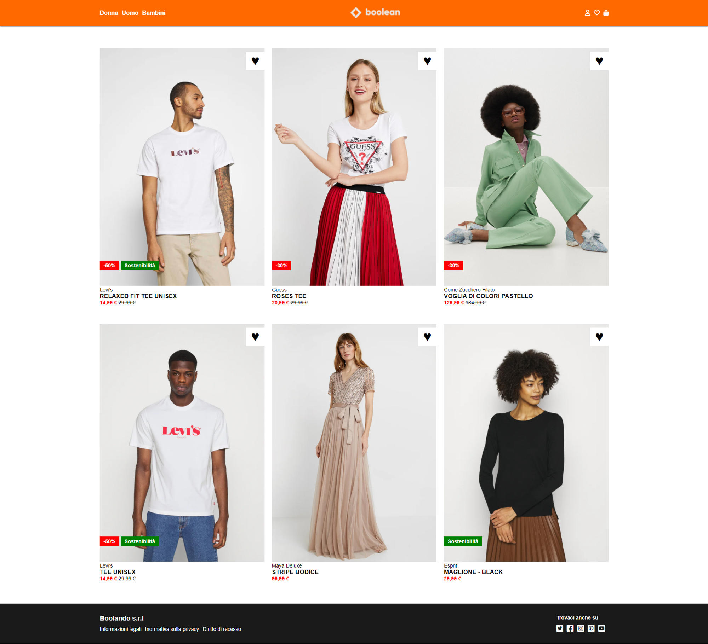

# Vite Boolando 🛍️

Vite Boolando è una pagina web sviluppata con Vite, Vue.js e Sass. Consente agli utenti di visualizzare gli articoli di un ipotetico store disponibili online utilizzando un file JSON

## Struttura del progetto

•index.html: Contiene la struttura HTML della pagina web e inclusione del main.js.

•📂Src: principali 3 cartelle del progetto. 

    •📂assets
    |   |
    |   |_•📂data
    |   |   |
    |   |   |_JSON
    |   |
    |   |_•📂styles
    |       |
    |       |_📂/partials --> 
    |       |
    |       |_main.scss
    •components    
    |   |
    |   |_•AppCard
    |   |
    |   |_•AppHeader
    |   |
    |   |_•AppFooter
    |   |
    |   |_•AppMain
    |   
    •📂img   
•App.vue: Contiene importazione dei componenti e assemblaggio nel <template/>
.

•main.js: destrutturazione di createApp ,importazione del file ./style.scss e metodo .mount() per montare l'applicativo sull index.html

## Preview

![App Screenshot]

## 🚀 About Me

•Nome: Livington Merello 

•Email: livington.merello@gmail.com

•GitHub: LivingtonMerello98
